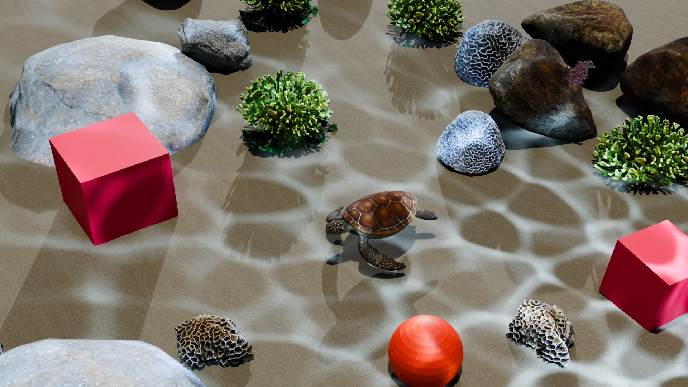
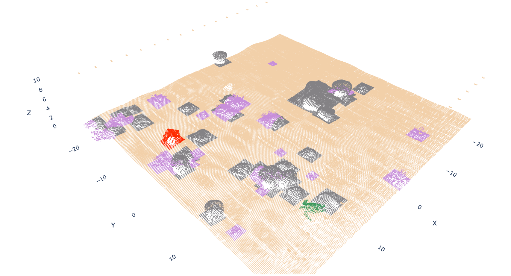

# Project LiAISon: Underwater Point-Cloud Anomaly Detection

**Texas A&M University — DAEN 460 Capstone, Spring 2026**

**Team ML8:** Maddie Bird, Leisha Khapre, Inayaa Khoja, Gaurav Shatoor, Jade Winebright  
**Project Sponsor:** MerLion Advisory Group  
**Sponsor:** Arnie Tyler  
**Faculty Advisor:** Dr. Alfredo Garcia  
**Advisor:** Anshul Yadav



### Example Labeled Point Cloud



## Project Overview

Project LiAISon developed an end-to-end anomaly-detection workflow for synthetic fused sonar–LiDAR point-cloud data to support safer and more efficient underwater infrastructure inspections.

The final workflow:

1. Generates randomized underwater scenes with embedded anomalies in Blender.
2. Simulates systematic scanning and exports point-cloud data.
3. Assigns semantic classes and labels points using scene-object metadata.
4. Preprocesses and clusters non-seafloor point-cloud returns.
5. Uses a two-stage PointNet pipeline for anomaly detection and classification.
6. Produces predictions and visualizations for evaluation.

The final project generated **120 synthetic scenes** with randomized object placement.

## Problem

Traditional underwater infrastructure inspections often rely on divers, making inspection time-consuming, hazardous, and potentially inconsistent under poor visibility, currents, and equipment constraints. This capstone explored a reproducible machine-learning workflow that could eventually operate on MerLion's real sonar/LiDAR inspection data.

## Data Generation Pipeline

```text
Randomized Blender scene
        ↓
Scan-readiness validation
        ↓
50 m × 50 m scan path
        ↓
Batch simulated scanning
        ↓
Combined point cloud
        ↓
Object metadata + semantic labeling
        ↓
Labeled point-cloud CSV
```

Synthetic scenes contain natural underwater objects together with intentionally embedded anomalies. The project uses seven semantic classes:

| ID | Class |
|---:|---|
| 0 | Seafloor |
| 1 | Cube anomaly |
| 2 | Sphere anomaly |
| 3 | Boat anomaly |
| 4 | Coral |
| 5 | Rock |
| 6 | Wildlife |

## Modeling Approach

The selected solution was **object-level detection and classification using PointNet**.

During inference, DBSCAN forms spatial clusters from non-seafloor point-cloud returns. Each cluster then passes through:

- **Stage 1 — Binary detection:** anomaly vs. not anomaly
- **Stage 2 — Multiclass classification:** cube, sphere, or boat for clusters identified as anomalies

The pipeline can return a predicted label, confidence score, cluster centroid, and bounding-box extents for detected objects.

## Final Performance

### Stage 1 — Binary anomaly detection

Overall accuracy: **0.80**

| Class | Precision | Recall | F1 |
|---|---:|---:|---:|
| Not anomaly | 0.93 | 0.76 | 0.84 |
| Anomaly | 0.64 | 0.89 | 0.75 |

### Stage 2 — Anomaly classification

Overall accuracy: **0.91**

| Class | Precision | Recall | F1 |
|---|---:|---:|---:|
| Cube | 0.97 | 0.81 | 0.89 |
| Sphere | 0.97 | 0.99 | 0.90 |
| Boat | 0.70 | 0.96 | 0.81 |

## Repository Structure

```text
liaison-underwater-anomaly-detection/
├── README.md
├── requirements.txt
├── scene_generation/
│   ├── make_random_scenes.py
│   └── save_scales.py
├── scanning/
│   ├── scan_readiness_check.py
│   ├── 50x50_boat_path.py
│   ├── full_batch_scan.py
│   ├── combine_scans.py
│   └── one_run.py
├── labeling/
│   ├── assign_materials_export_metadata.py
│   ├── automated_assign_material_export_metadata.py
│   ├── label_points.py
│   ├── automated_label_points.py
│   └── labeling_parameters.txt
├── model/
│   └── pointnet_two_stage_with_timing.ipynb
├── images/
│   └── example_synthetic_scene.jpg
├── poster/
│   └── Project_LiAISon_Showcase_Poster.pptx
└── documentation/
    └── Project_LiAISon_Final_Report.pdf
```

## Code Notes

The project code and notebooks in this portfolio copy have been preserved from the original capstone work rather than rewritten for presentation.

Some scripts contain the original local Windows paths used during Blender development, and the model notebooks contain the original Google Drive configuration used in Google Colab. To reproduce the project in another environment, update those configuration paths before running.

The Blender scripts are intended to run within Blender's Python environment and rely on the project's Blender/BlAInder setup and scene assets.

## Model Environment

The final project was developed with Python 3.10+ and used libraries including:

- PyTorch
- Open3D
- scikit-learn
- pandas
- NumPy
- Matplotlib
- Plotly
- tqdm

A CUDA-capable GPU is strongly recommended; the final system was developed and tested using an NVIDIA T4.

## Portfolio Data Note

The complete generated dataset and Blender scene files are not included here because they are large generated artifacts. The repository instead includes the source code for scene generation, scanning, labeling, and modeling, along with the final report, showcase poster, and a representative synthetic scene.

## Team Contribution

This repository represents a **team capstone project**. The final project documentation lists Jade Winebright's role as **Development / Documenter / Reviewer**.

## Documentation

For the complete methodology, design decisions, economic and risk analyses, performance evaluation, deployment considerations, and future-work recommendations, see:

`documentation/Project_LiAISon_Final_Report.pdf`

The final showcase poster is available at:

`poster/Project LiAISon Poster.pdf`
